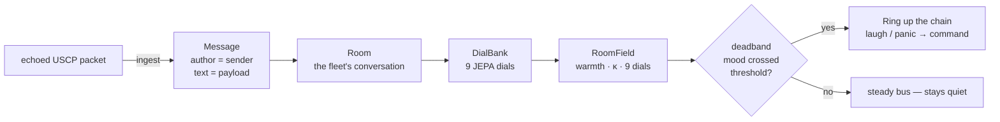

# 🔁 CNS Echo

A simple CNS echo agent that receives USCP signals and responds with structured analysis. Designed as:

- **A test agent** — verify the CNS bus is working by sending a signal and getting a response
- **A protocol validator** — checks every packet against the USCP-v1 spec and reports deviations
- **A first step for new agents** — drop-in boilerplate for anything joining the bus

## Features

- **Signal health scoring** — 0-100% compliance score for every incoming packet
- **Protocol validation** — checks required fields, valid priorities, known intents, checksums
- **Smart response intents** — suggests appropriate response intent based on incoming signal type
- **Emergency detection** — flags CRITICAL/EMERGENCY_HALT signals for immediate attention
- **Atomic writes** — responses use temp-then-rename for crash safety
- **Zero external deps** — pure Python standard library

## Install

```bash
pip install -e .
```

## Usage

```bash
# Process current inbox once and exit
cns-echo

# Watch mode — continuously monitor inbox and respond
cns-echo --watch

# Custom paths
cns-echo --inbox /path/to/cns_inbox --outbox /path/to/cns_outbox --watch

# Consume signals after processing (prevents reprocessing)
cns-echo --watch --consume

# Dry run — analyze without writing responses
cns-echo --dry-run

# Custom agent identity
cns-echo --watch --agent-id my-agent
```

## Analysis Output

Each signal receives:

| Check | Description |
|-------|-------------|
| Header fields | origin_id, timestamp, priority, sequence_id present |
| Priority valid | One of LOW, MEDIUM, HIGH, CRITICAL |
| Body fields | intent and payload present |
| Intent known | Matches standard USCP intent set |
| Payload structure | Has type and data fields |
| Signature | type and checksum present |
| Checksum | Content hash or "verified" convention |

## Echo Space — the bus as a room the elephant reads

The CNS bus isn't just a stream of packets — it's a *conversation*, and a
conversation has a temperature. `EchoSpace` (`cns_echo.echo_space`) mates the
echo to the elephant's space abstraction: every echoed packet becomes a
`Message` the elephant can read, the dial bank feels the fleet's warmth, and
the field's deadband **rings when the bus's mood crosses a threshold** — a
fleet-wide laugh or a fleet-wide panic, ringing up the chain as a command.




```python
from cns_echo.echo_space import EchoSpace

space = EchoSpace("cns-bus")
space.ingest(packet)            # echoed packet -> Message
field = space.read_field()      # DialBank -> RoomField (warmth, κ, 9 dials)
ring = space.deadband_check()   # a Ring when the bus's mood crosses
```

Full writeup: [`docs/echo-space.md`](docs/echo-space.md).

## License

MIT
