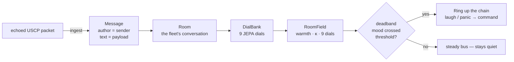

# 🔁 CNS Echo

A CNS echo agent that receives **USCP-v1** signals on the fleet's CNS bus
(Collective Nervous System) and responds with structured analysis. The CNS is
the central nervous system message bus that all SuperInstance agents speak over;
`cns-echo` is the bus's stethoscope.

<p align="center">
  
</p>

It exists as three things:

- **A test agent** — verify the CNS bus is working by sending a signal and getting a response
- **A protocol validator** — checks every packet against the USCP-v1 spec and reports deviations
- **A first step for new agents** — drop-in boilerplate for anything joining the bus

And, since the echo-space maturation, a fourth:

- **A room the elephant reads** — `EchoSpace` turns the echoed packet stream into a
  `Room` with warmth, dials, and a deadband that rings when the fleet's mood crosses
  a threshold (see below).

## Features

- **Signal health scoring** — 0–100% compliance score for every incoming packet
- **Protocol validation** — checks required fields, valid priorities, known intents, checksums
- **Smart response intents** — suggests an appropriate response intent based on incoming signal type
- **Emergency detection** — flags CRITICAL / `EMERGENCY_HALT` signals for immediate attention
- **Atomic writes** — responses use temp-then-rename for crash safety
- **NaN guards** — malformed packets (bad JSON, NaN/Inf floats, broken sections) are skipped or sanitized, never fatal
- **Zero external deps** — pure Python standard library (`requires-python >= 3.9`)

## Install

```bash
pip install -e .

# dev extras (pytest)
pip install -e ".[dev]"
```

This installs the `cns-echo` console script (entry point: `cns_echo.cli:main`).

## Usage

```bash
# Process current inbox once and exit
cns-echo

# Watch mode — continuously monitor inbox and respond
cns-echo --watch

# Custom paths
cns-echo --inbox /path/to/cns_inbox --outbox /path/to/cns_outbox --watch

# Consume signals after processing (prevents reprocessing)
cns-echo --watch --consume

# Dry run — analyze without writing responses
cns-echo --dry-run

# Custom agent identity / poll interval
cns-echo --watch --agent-id my-agent --interval 0.5

# The fleet's EKG strip — one JSON line per field window
cns-echo --watch --mood-log
```

### CLI flags

| Flag | Default | Meaning |
|------|---------|---------|
| `--inbox` | `~/.hermes/cns_inbox/` | Inbox directory to read signals from |
| `--outbox` | `~/.hermes/cns_outbox/` | Outbox directory for response packets |
| `--agent-id` | `cns-echo` | `origin_id` stamped on responses |
| `--watch` | off | Keep polling instead of one-shot |
| `--interval` | `1.0` | Poll interval (seconds) in watch mode |
| `--consume` | off | Delete inbox signals after processing |
| `--dry-run` | off | Analyze and print without writing responses |
| `--mood-log [PATH]` | off | Append one JSON line per field window to `PATH` (default: `fleet-mood.jsonl`) — the fleet's EKG strip |
| `--version` | — | Print version and exit |

### What the console output looks like

```
  ◆ [MEDIUM] test-agent-1 → QUERY
    Health: 100%  |  Checks: 7/7  |  Time: 0.4ms
    ✓ Echoed to test-agent-1 (response in outbox)
```

### Examples

Runnable, dependency-free examples live in [`examples/`](examples/):

- [`examples/handshake.py`](examples/handshake.py) — build a valid USCP-v1
  `INTRODUCTION` packet, analyze it, and write a response via `Responder`.
- [`examples/malformed_detection.py`](examples/malformed_detection.py) — feed
  broken packets to the analyzer and watch the health score drop.
- [`examples/watch_demo.sh`](examples/watch_demo.sh) — end-to-end demo: creates
  temp inboxes, drops three test signals, runs `cns-echo` one-shot over them.

## Analysis output

Each signal receives:

| Check | Description |
|-------|-------------|
| Header fields | `origin_id`, `timestamp`, `priority`, `sequence_id` present |
| Priority valid | One of LOW, MEDIUM, HIGH, CRITICAL |
| Body fields | `intent` and `payload` present |
| Intent known | Matches the standard USCP intent set (`EXECUTE_PLAN`, `SENSORY_DATA`, `REQUEST_REASONING`, `HANDSHAKE_COMPLETE`, `EMERGENCY_HALT`, `INTRODUCTION`, `QUERY`, `STATUS_REPORT`, `TELEMETRY`, `ARTIFACT_SHARE`) |
| Payload structure | Has `type` and `data` fields |
| Signature | `type` and `checksum` present |
| Checksum | Content hash (sha256 of header+body, first 16 hex chars) or the `"verified"` / `"handshake-verified"` convention |

The analyzer (`cns_echo.echo.analyze`) also proposes a response: a suggested
intent, priority, and payload based on the incoming signal type. The
`Responder` (`cns_echo.responder`) turns that into a USCP-v1 response packet and
writes it atomically into the outbox.

## Echo Space — the bus as a room the elephant reads

The CNS bus isn't just a stream of packets — it's a *conversation*, and a
conversation has a temperature. `EchoSpace` (`cns_echo.echo_space`) mates the
echo to the elephant's space abstraction: every echoed packet becomes a
`Message` the elephant can read, the dial bank feels the fleet's warmth, and
the field's deadband **rings when the bus's mood crosses a threshold** — a
fleet-wide laugh or a fleet-wide panic, ringing up the chain as a command.




```python
from cns_echo.echo_space import EchoSpace

space = EchoSpace("cns-bus")
space.ingest(packet)            # echoed packet -> Message
field = space.read_field()      # DialBank -> RoomField (warmth, κ, 9 dials)
ring = space.deadband_check()   # a Ring when the bus's mood crosses
```

### The ring travels

In `--watch` mode every analyzed packet is fed into a module-level
`EchoSpace` (`cns_echo.cli.ECHO_SPACE`). After each batch the deadband is
checked, and on a `Ring` the `Responder` writes a USCP-v1 `STATUS_REPORT`
into the outbox — **HIGH** priority for panic, **MEDIUM** for warmth swings —
with the ring and the current field as payload. One packet per ring edge
(rising only, hysteresis re-anchored on every ring), not per poll: the
deadband is the whole point.

```python
from cns_echo.responder import Responder, ring_priority

path = responder.respond_ring(ring, space.read_field())   # -> outbox/*.json
```

### The EKG strip

`EchoSpace` also keeps a bounded rolling `FieldHistory`: every `window`
packets (100 by default) one `FieldEntry` — the field at the moment the
window closed — is committed to a deque that holds at most `max_windows`
entries (50 by default). Bounded by law, like every elephant window.
With `--mood-log`, each committed window also appends one JSON line to
`fleet-mood.jsonl`, so every agent on the bus can read the fleet's mood
as a file — the in-memory deque is working memory, the strip is the
timeline.

```json
{"dials": {"mood": 0.25, "panic": 0.0, ...}, "kappa": 0.87,
 "packets": 100, "space": "cns-echo-bus", "ts": 1755523200.0,
 "warmth": 0.12, "window": 42}
```

```python
space = EchoSpace("cns-bus", window=100, max_windows=50,
                  mood_log="fleet-mood.jsonl")
space.ingest(*packets)              # windows close as packets flow in
space.history.latest                # the newest FieldEntry
len(space.history)                  # <= max_windows, forever
```

### The zero-dependency import rule

`EchoSpace` uses the real elephant's `Room`/`Message`/`Dial`/`DialBank`/
`RoomField` if the `elephant` package is importable (via the `ELEPHANT_ROOT`
env var or a sibling checkout at `../elephant`). Otherwise it falls back to a
minimal pure-Python subset implementing the same seams — so cns-echo keeps its
"pure standard library" guarantee either way. `HAS_ELEPHANT` reports which one
is live. The rule from the spaces spec: **JEPA correlates; it never replaces.**

Full writeup: [`docs/echo-space.md`](docs/echo-space.md).
Usage guide: [`docs/usage.md`](docs/usage.md).

## Package layout

```
src/cns_echo/
├── cli.py         # argparse entry point, watch loop, console output
├── echo.py        # analyze(): USCP validation + health scoring
├── responder.py   # Responder: builds + atomically writes response packets
└── echo_space.py  # EchoSpace: bus-as-room adapter for the elephant
```

## Testing

```bash
pytest            # 168 tests
```

CI runs pytest on every push (`.github/workflows/`).

## Fleet context

cns-echo speaks on the same CNS bus as the audio and coordination fleet:

- **fleet-cns** — the bus itself (inboxes/outboxes, USCP spec)
- **fleet-audio** — renders CNS MIDI events to audio
- **fleet-ensemble** — musical coordination over the bus
- **elephant** — reads this bus through `EchoSpace`

## License

MIT

## Architecture

```
cns_echo/
├── cli.py        # argument parsing, watch loop, console output
├── echo.py       # EchoAnalyzer — USCP-v1 validation + health scoring
├── responder.py  # Responder — atomic (temp+rename) reply packet writer
└── echo_space.py # EchoSpace — the elephant adapter (bus stream → Room)
```

The pipeline is strictly one-way per packet: **read** (inbox file) →
**analyze** (`EchoAnalyzer`) → **echo** (`Responder` writes to outbox) →
optionally **consume** (delete inbox signal). Every step is filesystem-based,
which is the whole point: the CNS bus is a shared directory tree, so any
agent can join with nothing but file-write permission. No daemon, no socket,
no broker to babysit.

### The elephant bridge

`EchoSpace` (see [docs/echo-space.md](docs/echo-space.md)) adapts the echo
stream into the elephant's `Room`/`DialBank`/`RoomField` model:

- every echoed packet becomes a `Message` with agent identity and timing
- dials read the *stream*, not the payload — volume (packets/min),
  urgency mix (CRITICAL fraction), deviation (protocol-health trend)
- the deadband "rings" when a dial crosses its threshold, emitting a
  signal the chain of command can act on (host → foreman → captain)

JEPA correlates; it never replaces. The protocol layer stays pure USCP-v1.

## Testing

```bash
python -m pytest                    # full suite
python -m pytest tests/test_echo.py -k health   # one module / one case
```

## Fleet context

CNS Echo was built during the Aug 2026 maturation waves to harden the
fleet's nervous system. It pairs with `cns-bridge` (bus-as-space on the
elephant side) and `wesley-cns-adapter` (the ensign's mailbox). If the
bus is the spine, cns-echo is the reflex arc: signal in, analysis out,
no thought required — which is exactly what you want from a stethoscope.
